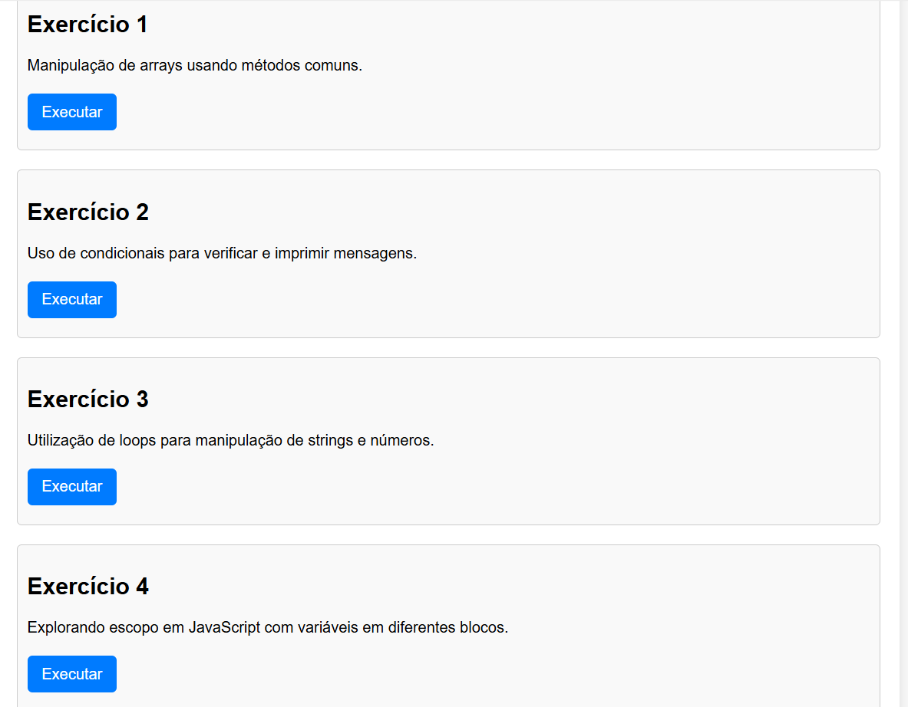
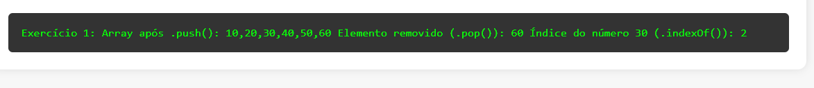
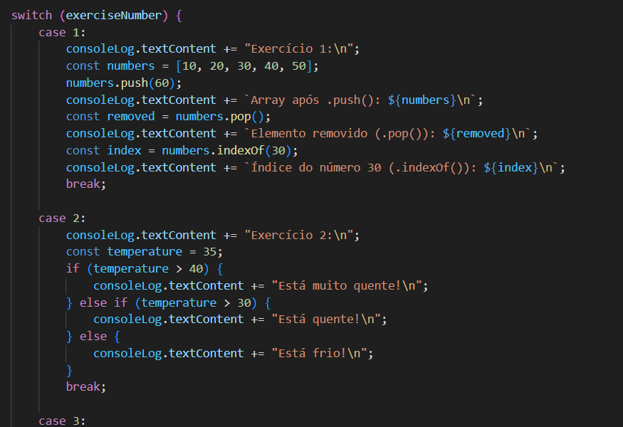

# Exercicio AUla 06 - Joelysom

## Documentação e HTML

- Para Executar os exercicios basta apertar o botão "iniciar" para exercutar o codigo na saída abaixo dos botões:


- Saída do Exercicio com resultado do script já integrado no HTML


## Vasculhando mais fundo o HTML

- Utilizando Switch para gerenciar os exercicios aparentes no pseudo terminal.



```
<script>
        function runExercise(exerciseNumber) {
            const consoleLog = document.getElementById('consoleLog');
            consoleLog.textContent = ''; // Limpa o console

            switch (exerciseNumber) {
                case 1:
                    consoleLog.textContent += "Exercício 1:\n";
                    const numbers = [10, 20, 30, 40, 50];
                    numbers.push(60);
                    consoleLog.textContent += `Array após .push(): ${numbers}\n`;
                    const removed = numbers.pop();
                    consoleLog.textContent += `Elemento removido (.pop()): ${removed}\n`;
                    const index = numbers.indexOf(30);
                    consoleLog.textContent += `Índice do número 30 (.indexOf()): ${index}\n`;
                    break;

                case 2:
                    consoleLog.textContent += "Exercício 2:\n";
                    const temperature = 35;
                    if (temperature > 40) {
                        consoleLog.textContent += "Está muito quente!\n";
                    } else if (temperature > 30) {
                        consoleLog.textContent += "Está quente!\n";
                    } else {
                        consoleLog.textContent += "Está frio!\n";
                    }
                    break;

                case 3:
                    consoleLog.textContent += "Exercício 3:\n";
                    const phrase = "JavaScript is fun!";
                    let counter = 0;
                    for (let i = 0; i < phrase.length; i++) {
                        consoleLog.textContent += `Caractere ${i}: ${phrase[i]}\n`;
                        if (phrase[i].toLowerCase() === 'a') counter++;
                    }
                    consoleLog.textContent += `Quantidade de letras 'a': ${counter}\n`;

                    let number = 1;
                    while (number <= 10) {
                        consoleLog.textContent += `Número: ${number}\n`;
                        number++;
                    }
                    break;

                case 4:
                    consoleLog.textContent += "Exercício 4:\n";
                    const x = 100; // Escopo global
                    consoleLog.textContent += `x (escopo global): ${x}\n`;

                    function testScope() {
                        const x = 50; // Escopo da função
                        consoleLog.textContent += `x (escopo da função): ${x}\n`;
                        if (true) {
                            const x = 30; // Escopo do bloco
                            consoleLog.textContent += `x (escopo do bloco): ${x}\n`;
                        }
                    }

                    testScope();
                    consoleLog.textContent += `x (fora da função): ${x}\n`;
                    break;

                default:
                    consoleLog.textContent += "Exercício não encontrado.\n";
                    break;
            }
        }
    </script>
```
---