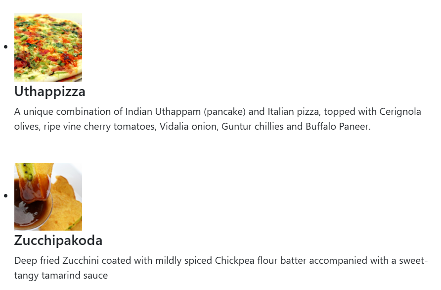
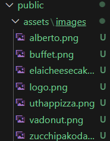

# Documentação do Componente MenuComponent

## **Descrição Geral**
O código é um componente do React chamado `MenuComponent`. Ele mostra uma lista de pratos em um layout responsivo. As informações dos pratos são armazenadas em um estado local e contém detalhes como nome, imagem, categoria, preço, etiqueta/label e descrição. O componente utiliza o pacote `reactstrap` para facilitar a estilização e o layout.



---

## **A Estrutura do Código**
### **1. Importações**
```javascript
import React, { useState } from 'react';
import { Media } from 'reactstrap';
```
- **`React` e `useState`:** para criar o que é funcional e gerenciar o estado local.
- **`Media` (reactstrap):** para renderizar layouts baseados em mídia, como imagens e texto associados.

---

### **2. Estrutura do Estado Local**
O estado `dishes` é definido usando `useState`. Ele contém um array de objetos, onde cada objeto representa um prato.

#### Exemplo de um Objeto do Estado:
```javascript
{
  id: 0,
  name: 'Uthappizza',
  image: '/assets/images/uthappizza.png',
  category: 'mains',
  label: 'Hot',
  price: '4.99',
  description: 'Uma combinação única de Uthappam indiano e pizza italiana.'
}
```


**Propriedades:**
- **`id`:** Identificador do prato.
- **`name`:** Nome do prato.
- **`image`:** Caminho para a imagem do prato.
- **`category`:** Categoria (entrada, prato principal, sobremesa).
- **`label`:** Etiqueta("Hot" ou "New").
- **`price`:** Preço do prato.

---

### **3.Lista de Pratos**
O `map` é usado para o array de pratos e gerar os elementos JSX correspondentes.

#### Código:
```javascript
const menu = dishes.map((dish) => {
  return (
    <div key={dish.id} className="col-12 mt-5">
      <Media tag="li">
        <Media left middle>
          <Media object src={dish.image} alt={dish.name} />
        </Media>
        <Media body className="ml-5">
          <Media heading>{dish.name}</Media>
          <p>{dish.description}</p>
        </Media>
      </Media>
    </div>
  );
});
```

**O que acontece aqui?🤔**
1. **`map`faz:** Cada objeto `dish` do array é transformado em JSX.
2. **Renderização de Elementos:**
   - **Imagem:** `<Media object src={dish.image} />`.
   - **Nome do Prato:** `<Media heading>{dish.name}</Media>`.
3. **Identificador `key`:** para fazer cada "elemento" ser unico na lista.

---

### **4. Layout Principal**
O JSX final é retornado `return`.

#### Trecho do Código:
```javascript
return (
  <div className="container">
    <div className="row">
      <Media list>
        {menu}
      </Media>
    </div>
  </div>
);
```

**Detalhes:**
- **`<div className="container">`:** Define um contêiner principal responsivo.
- **`<div className="row">`:** Faz um grupo dos "elementos" em uma linha.
- **`<Media list>`:** Lista de itens do tipo mídia.
- **`{menu}`:** Insere os "elementos" gerados pela função `map`.

---

### **5. Exportação do Componente**
O componente é exportado como padrão, assim pode ser usado em outros arquivos.
```javascript
export default Menu;
```

---

## **Dependências**
1. **Reactstrap:** precisa ter o pacote `reactstrap` instalado:
   ```bash
   npm install reactstrap bootstrap
   ```

2. **Bootstrap:** por o CSS do Bootstrap no arquivo `index.js`:
   ```javascript
   import 'bootstrap/dist/css/bootstrap.min.css';
   ```

---

## **Configuração de Imagens**
As imagens precisam ser colocadas na pasta `public/assets/images` para serem mostradas.

**Exemplo de Caminho:**
```plaintext
public/assets/images/uthappizza.png
```
No código:
```javascript
image: '/assets/images/uthappizza.png',
```
---

## **Resumo**
O `MenuComponent` é responsável por criar uma lista de pratos usando React e Reactstrap. Ele organiza os dados e estiliza os elementos utilizando classes do Bootstrap e recursos de layout.

---

**👍Dicas Legais👍:**
- criar funcionalidades de interação, como eventos de clique ou seleção de pratos.(tipo aqueles cardápios digitais de hoje em dia).
- Melhorar o acesso e a resposta para dispositivos móveis(tentei usar o link remoto para acessar o teste pelo wi-fi do senac e ficou meio bugado).

**Notinhas📜:**
- achei interessante o useState para gerenciar o estado local do componente de forma fácil, mantendo os dados dos pratos centralizados.
Adicionar, remover ou modificar pratos será fácil, porque, os dados estão em um único local.
# **"Que nada nos defina. Que nada nos sujeite. Que a liberdade seja a nossa própria substância."** - Simone de Beauvoir

